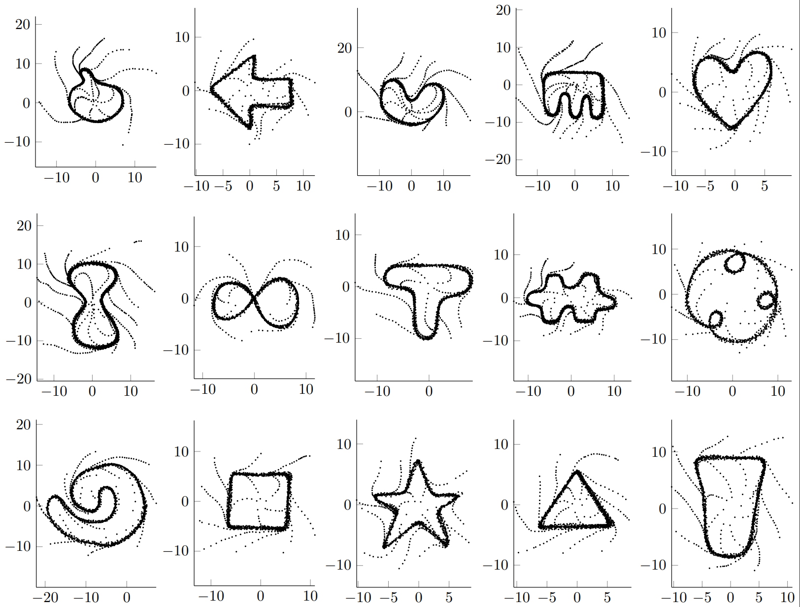

# HRLimitCycleDataSet

The repository contains handrawn limit cycles with distinct shapes intented to help test different implementations of Learning from Demonstration schemes. There are in total 15 shapes with dinstict levels of dificulty to learn. The dataset was collected using a digital pen and pad. 

Each shape has a corresponding name to be used and refered to. To simplify integration with other researchers we currently provide data files stored in matlab format, i.g. ".mat" file where each demonstration of a given shape is recorded in a structure. Each structure has two fields, data(i).pos refers to the position data and data(i).vel contains the derivative of the data(i).pos, properly filtered to mitigate problematic noise whilst collecting the data.  

The dataset is shown in the following Figure.

Notice that the dataset not only contains data over the limit cycle, as well as data moving towards the limit cycle. We believe that any method properly trying to learn limit cycles needs to also encode.